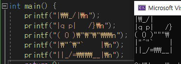

# 백준 풀이 연습장

- 백준 코딩문제 풀이 연습장
- https://www.acmicpc.net/
- 단계별로_풀어보기 현재 진도 [확인](./C99_Step_by_Step/TRACKER.md)


## 기록 노트
### 1단계 - 입출력과 사칙연산
- long long 타입이라는 친구도 있더라 [_>](./C99_Step_by_Step/Step01/10172.c)
```c 
    long long A, B, C;
    scanf("%lld %lld %lld", &A, &B, &C);
```
- c언어 큰따옴표(")출력은 \로 이스케이프 [_>](./C99_Step_by_Step/Step01/11382-롱롱.c)


### 2단계 - 조건문
- 특이사항 無

### 3단계 - 반복문
- 가변 길이 배열은 c언어에서 안 된다고 알고 있었는데, C99이상 버전에서는 된다고 한다. malloc을 안 써도 된다니!
[_>](./C99_Step_by_Step/Step03/10950-A+B.c)


