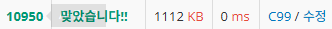

## 코딩문제 풀이 연습장

- 코딩문제 풀이 연습장
- [Baekjoon](https://www.acmicpc.net/)


## 기록 노트
<details>
<summary>단계별 풀이 기록</summary>

- 단계별로_풀어보기 현재 진도 [확인](./C99_Step_by_Step/TRACKER.md)

### 1단계 - 입출력과 사칙연산 
- long long 타입이라는 친구도 있더라 [_>](./C99_Step_by_Step/Step01/10172.c)
```c 
    long long A, B, C;
    scanf("%lld %lld %lld", &A, &B, &C);
```
- c언어 큰따옴표(")출력은 \로 이스케이프 [_>](./C99_Step_by_Step/Step01/11382-롱롱.c)


### 2단계 - 조건문
- 특이사항 無

### 3단계 - 반복문
- 가변 길이 배열은 c언어에서 안 된다고 알고 있었는데, C99이상 버전에서는 된다고 한다. malloc을 안 써도 된다니!
- Visual Stdio에서는 에러난다. [_>](./C99_Step_by_Step/Step03/10950-A+B.c)


- 입력 -> 출력 -> 입력 -> 출력이 허용되는 줄도 모르고 어렵게 풀고 있었다... 즉, 지금까지는 배열을 쓸 필요가 없었음 [깨달음 _>](./C99_Step_by_Step/Step03/10952-A+B.c)

- C언어의 EOF에 대하여 [_>](./C99_Step_by_Step/Step03/10951-EOF.c) / [참고자료](https://ip99202.github.io/posts/C%EC%96%B8%EC%96%B4-eof-%EC%B2%98%EB%A6%AC%ED%95%98%EB%8A%94-%EB%B0%A9%EB%B2%95/)

### 4단계 - 1단계 배열
- 문제를 잘 읽어야 함과 적절한 자료형 선택의 중요성.[->](./C99_Step_by_Step/Step04/1546-평균.c)

### 5단계 - 문자열
- c언어에서 문자열 -> 정수로 받는 방법 [_>](./C99_Step_by_Step//Step05/11720-숫자합.c)
- c언어에서 scanf를 그냥 쓰면 공백 안 받음. [_>](./C99_Step_by_Step/Step05/1152-단어개수.c)
- 정수 -> 문자열 [_>](./C99_Step_by_Step/Step05/2908-큰숫자거꾸로.c)
- 쉽게 풀긴 했는데 더 좋은 방법이 있지 않을까 영 찝찝함 [_>](./C99_Step_by_Step/Step05/5622-다이얼전화.c)


### 6단계 - 심화 1
- [_>](./C99_Step_by_Step/Step06/1157-단어공부-시간복잡도%20이슈.c) 이 소스 컴파일러에선 문제가 없는데 백준에선 아무래도 100만 x 100만이라 문제가 발생해서 정답처리가 안 됨.
```c
    // 알파벳순 정렬
    char temp;
    for (int i = 0; i < strlen(word); i++) {
        for (int j = 0; j < i; j++) {
            if (word[j] > word[i]) {
                temp = word[i];
                word[i] = word[j];
                word[j] = temp;
            }
        }
    }
```
 정렬 없이 풀어야겠음.
 
 ㄴ-> 정렬없이 풀었는데도 시간초과 에러뜨길래 알아봤더니 strlen도 꽤 시간이 걸리는 녀석이라고 함.
 [_>](./C99_Step_by_Step/Step06/1157-단어공부.c)
 원래 코드
 ```c
    char word[1000001];
    scanf("%s", word);

    // 대문자로 만들기
    for (int i = 0; i < strlen(word); i++) {
        if (word[i] > 90) word[i] = word[i] - 32;
    }
    int count[26] = { 0, };

    // 등장횟수
    for (int i = 0; i < strlen(word); i++) {
        count[word[i] - 65]++;
    }
 ``` 

 개선 코드
 ```c
    char word[1000001];
    scanf("%s", word);

    int count[26] = { 0, };
    // 대문자로 만들기 / 등장횟수
    for (int i = 0; i < strlen(word); i++) {
        if (word[i] > 90) word[i] = word[i] - 32;
        count[word[i] - 65]++;
    }
 ```
  근데 이래도 시간 초과래ㅋㅋ 미쳐버리겠음
  그래서 지피티한테 물어봤음...

  이유는 for문 안에 있는 strlen 자체가 문제였음
  ```c
  // 원래 쓴 모양
  for (int i = 0; i < strlen(word); i++)

  // 바꾼 모양
  int len = strlen(word);
  for (int i = 0; i < len; i++)
  ```
  이렇게 해야 strlen이 여러 번 호출 되지 않음.

`-----------------------------------------`
</details>

<details>
    <summary> 기타 문제 기록</summary>

</details>


<details>
    <summary>  </summary>

</details>